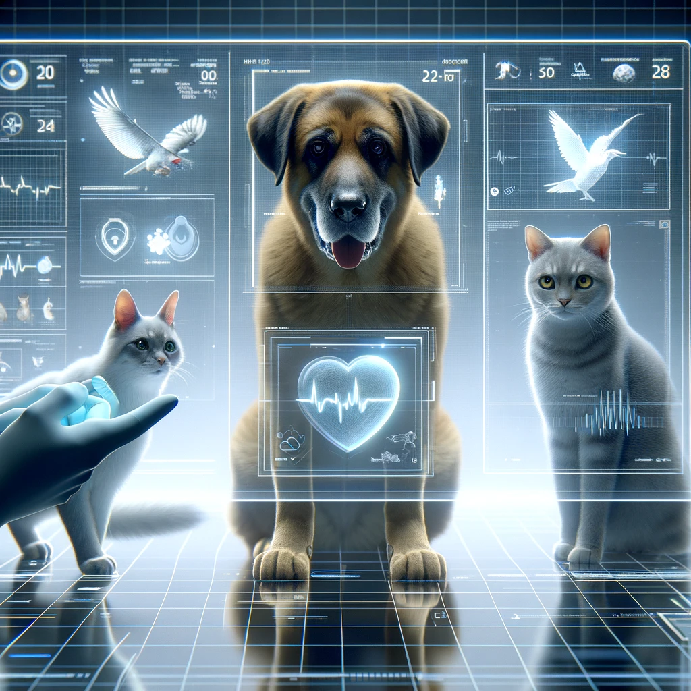
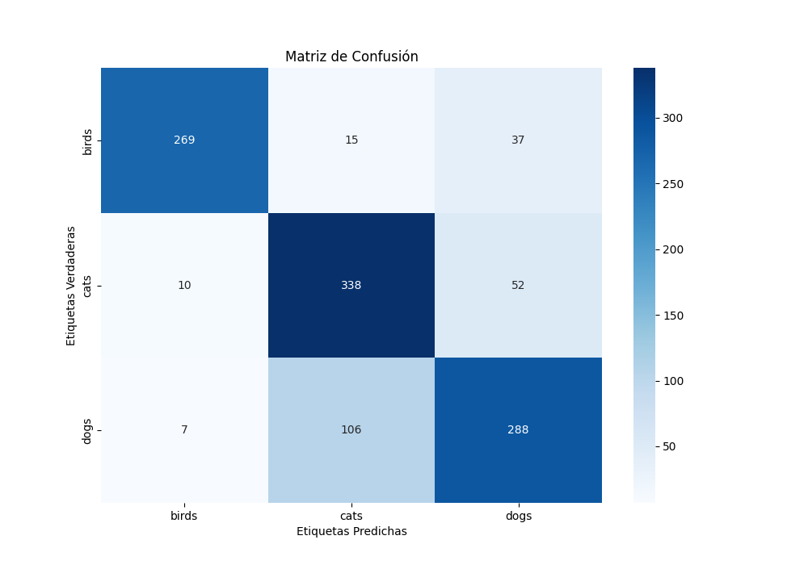
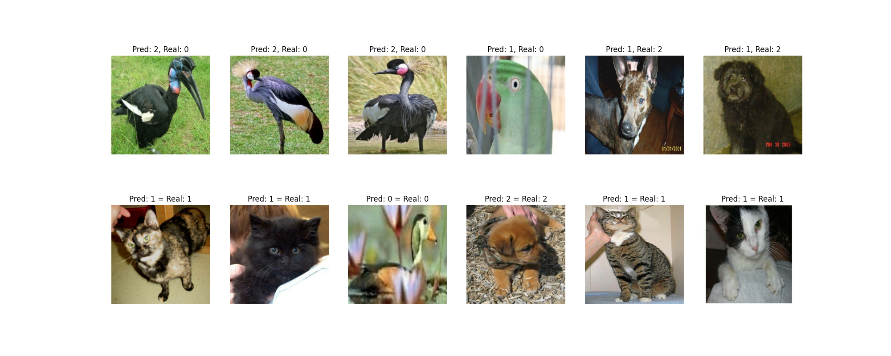

# Informe de Clasificación de Imágenes: Perros, Gatos y Pájaros

<center></center>

## Resumen
Este informe detalla el proceso y los resultados al construir y evaluar un modelo de clasificación de imágenes capaz de distinguir entre imágenes de perros, gatos y pájaros.

El objetivo es desarrollar un modelo con alta precisión y capacidad de generalización utilizando técnicas de deep learning a través de redes neuronales convolucionales (CNN).

A continuación, se presenta un resumen de las etapas clave del proyecto, incluyendo:
- Data collection
- Preparación de los datos,
- Diseño del modelo,
- Evaluación y optimización del mismo.

## Data Collection
Para el desarrollo de esta prueba los datos se recogieron de dos datasets distintos de Kaggle, el primero de [Aves](https://www.kaggle.com/datasets/umairshahpirzada/birds-20-species-image-classification) y el segundo de [Perros y Gatos](https://www.kaggle.com/datasets/tongpython/cat-and-dog) dando un total de 11.212 imágenes.

La distribución sería:
- 8970 imágenes en el set de train / 80%
- 1121 imágenes en el set de test / 10%
- 1121 imágenes en el set de validation / 10%

## Preparación de Datos
Los datos se organizaron en conjuntos de entrenamiento, validación y prueba.
Cada imagen fue redimensionada a un tamaño uniforme de 256x256 píxeles y normalizada para mejorar la eficiencia del entrenamiento a través de una layer adicional en la arquitectura del modelo.

```python
rescale_resize_layers = tf.keras.Sequential([
    layers.Resizing(IMAGE_SIZE, IMAGE_SIZE),
    layers.Rescaling(1.0/255)
])
```

### Augmentación de Datos

Para aumentar la robustez y mejorar la capacidad de generalización del modelo, se aplicó aumentación de datos (data augmentation) al conjunto de entrenamiento utilizando varias técnicas, con el objetivo de simular la variabilidad natural de las imágenes en un entorno real y prevenir el sobreajuste. Las técnicas aplicadas incluyen:

- Volteo aleatorio horizontal y vertical: Esto simula diferentes orientaciones de los objetos, lo que es común en fotografías de perros, gatos y pájaros.

- Rotación aleatoria de hasta 0.2 radianes: Introduce variabilidad en la orientación de las imágenes, ayudando al modelo a reconocer objetos sin importar pequeñas inclinaciones.

- Zoom aleatorio de hasta un 20%: Permite al modelo enfocarse en diferentes partes de la imagen, lo cual es útil para reconocer objetos cuando no están completamente visibles o están parcialmente obstruidos.

- Ajuste aleatorio del contraste: Mejora la capacidad del modelo para identificar características relevantes bajo diferentes condiciones de iluminación.

- Movimiento aleatorio en altura y anchura (RandomTranslation): Simula diferentes posiciones de los objetos dentro de la imagen, lo que ayuda al modelo a no depender de la ubicación específica del objeto para su reconocimiento.

Estas técnicas de aumentación de datos ayudan a crear un conjunto de entrenamiento más diverso y representativo, mejorando la capacidad del modelo para generalizar a partir de nuevas imágenes no vistas durante el entrenamiento.

```python
data_augmentation_layer = tf.keras.Sequential([
    layers.RandomFlip('horizontal_and_vertical'),
    layers.RandomRotation(0.2),
    layers.RandomZoom(0.2),
    layers.RandomContrast(factor=(0.2, 0.5)),
    layers.RandomTranslation(height_factor=0.1, width_factor=0.1, fill_mode='reflect')
])
```

## Arquitectura del Modelo

La arquitectura de la Red Neuronal Convolucional (CNN) diseñada para este proyecto consiste en una serie de capas cuidadosamente estructuradas para extraer y aprender eficazmente las características distintivas de imágenes de perros, gatos y pájaros. La red se compone de las siguientes capas y componentes:

- Capas de Preprocesamiento: Antes de alimentar las imágenes al modelo, se aplican técnicas de reescalado y normalización para asegurar que todas las imágenes tengan el mismo tamaño y estén normalizadas. Además, se utiliza data augmentation para mejorar la robustez del modelo.

- Capas de Convolución con Activación ReLU y BatchNormalization: Varias capas de convolución con filtros de tamaño (3, 3) y función de activación ReLU se utilizan para extraer características relevantes de las imágenes. La normalización por lotes (BatchNormalization) se aplica después de cada capa convolucional para acelerar la convergencia y estabilizar el entrenamiento.

- Capas de MaxPooling: Después de cada conjunto de capas de convolución y normalización, se utilizan capas de MaxPooling con un tamaño de ventana de (2, 2) para reducir la dimensionalidad de los mapas de características, lo que permite a la red ser más eficiente y reducir el riesgo de sobreajuste.

- Capas Dropout: Para prevenir el sobreajuste, se incorporan capas Dropout con tasas que varían entre 0.1 y 0.3, dependiendo de la posición en la arquitectura. Estas capas "desactivan" aleatoriamente un porcentaje de las neuronas durante el entrenamiento, lo que ayuda a que la red aprenda patrones más generalizables.

- Capa Flatten: Una capa Flatten convierte los mapas de características 3D resultantes de las capas convolucionales y de pooling en un vector 1D, permitiendo que las características extraídas se puedan utilizar en capas densas para la clasificación final.

- Capas Densas para la Clasificación: Al final de la red, se utilizan capas densas con 128 neuronas y activación ReLU para integrar las características aprendidas en representaciones más abstractas. La última capa densa utiliza la función de activación softmax para clasificar las imágenes en tres categorías (perros, gatos, pájaros), basándose en las probabilidades.

Esta arquitectura CNN está diseñada para capturar tanto las características visuales de bajo nivel (bordes, texturas) como las de alto nivel (formas, patrones complejos) de las imágenes, facilitando una clasificación precisa y efectiva.

El modelo fue compilado con el optimizador Adam y la función de pérdida `sparse_categorical_crossentropy`.

## Entrenamiento del Modelo
El proceso de entrenamiento del modelo fue meticulosamente planificado para asegurar una optimización efectiva y prevenir el sobreajuste. Se ejecutó un total de 30 épocas, pero con estrategias específicas para ajustar la tasa de aprendizaje y detener el entrenamiento de manera precoz si era necesario.

### Estrategias Implementadas:

- EarlyStopping: Para prevenir el sobreajuste y optimizar el uso de recursos, se implementó una estrategia de EarlyStopping con una paciencia de 10 épocas. Esta técnica detiene el entrenamiento si no se observan mejoras significativas en la pérdida de validación, garantizando que el modelo no aprenda detalles superfluos que podrían dañar su capacidad de generalización.

- LearningRateScheduler: Se diseñó un ajuste dinámico de la tasa de aprendizaje durante el entrenamiento para mejorar la convergencia del modelo. Durante las primeras 10 épocas, se mantuvo constante la tasa de aprendizaje para permitir que el modelo explorara el espacio de soluciones. A partir de la época 11 y hasta la 14, se aplicó una reducción exponencial de la tasa de aprendizaje, específicamente multiplicando la tasa actual por −0.1e −0.1 en cada época, para refinar la búsqueda de un mínimo global en el espacio de soluciones.

- Mantenimiento del Learning Rate Post-Epoca 14: Basándose en la experimentación y los resultados observados, se decidió mantener constante la tasa de aprendizaje después de la época 14 en un valor de 6.2500×10−56.2500×10 −5  (6.2500e−05 en notación científica). Este valor específico se identificó como óptimo para continuar el proceso de aprendizaje sin provocar oscilaciones o convergencias prematuras.


```python
if epoch < 10:
        return lr
    elif epoch < 14:
        return lr * np.exp(-0.1)
    else:
        # Mantén el learning rate constante después de la epoch 14
        return 6.2500e-05
        Este valor de 
``` 

Este valor fue seleccionado tras un análisis detallado de los resultados de entrenamiento de modelos anteriores. Mostró ser el punto de equilibrio perfecto donde el modelo continuaba aprendiendo a un ritmo adecuado, permitiendo mejoras incrementales en precisión sin caer en el sobreajuste.

- Potencial de Mejora:
Aunque se observaron mejoras significativas en el rendimiento del modelo hasta la época número 20, se reconoce que existe margen de mejora. Ajustar de nuevo el Learning Rate después de la época 20 podría permitir afinar aún más las capacidades del modelo, potencialmente conduciendo a una mayor precisión y generalización en la clasificación de imágenes.

Este enfoque cuidadoso y adaptativo hacia el entrenamiento asegura no solo la eficiencia en el aprendizaje sino también la obtención de un modelo robusto y de alta precisión, apto para el objetivo de distinguir con éxito entre imágenes de perros, gatos y pájaros.

## Resultados

El modelo demostró una precisión general del 80% en el conjunto de prueba, un indicador sólido de su capacidad para clasificar con eficacia entre imágenes de aves, gatos y perros. A continuación, se detalla el desempeño del modelo por clase, junto con insights derivados de la matriz de confusión:

### Métricas por Clase:

- **Aves (Clase 0):** Exhibió una precisión impresionante del 94% y un recall del 84%, lo que indica una alta efectividad al identificar correctamente imágenes de aves, con una tasa menor de falsos negativos.

- **Gatos (Clase 1):** La precisión fue del 74% con un recall del 84%. Esto refleja una capacidad competente para reconocer gatos, aunque con un margen más amplio para mejora en precisión debido a falsos positivos.

- **Perros (Clase 2):** Registró una precisión del 76% y un recall del 72%, señalando una habilidad razonable para clasificar perros, aunque se observó una mayor proporción de falsos negativos comparado con las otras clases.

### Matriz de Confusión:


La matriz de confusión proporciona una vista detallada de la performance del modelo:

- **Aves:** De 321 imágenes de aves, 269 fueron clasificadas correctamente, mientras que 15 fueron confundidas como gatos y 37 como perros.

- **Gatos:** De 400 imágenes de gatos, 338 se identificaron acertadamente. Sin embargo, 10 se confundieron con aves y 52 con perros, indicando una tendencia del modelo a confundir gatos con perros.

- **Perros:** De 401 imágenes de perros, 288 se clasificaron correctamente. Se observó que 7 se confundieron como aves y 106 como gatos, resaltando una dificultad particular en distinguir entre gatos y perros.


Estas métricas y la matriz de confusión revelan una sólida capacidad del modelo para clasificar imágenes entre las tres categorías. Sin embargo, destacan un desafío específico en diferenciar entre gatos y perros, lo que sugiere un área de enfoque para la optimización futura del modelo. La confusión entre estas dos clases podría abordarse mediante un entrenamiento adicional, un ajuste fino de las capas del modelo, o incluso la incorporación de más datos que ayuden a mejorar la distinción entre características similares de estas dos especies.

## Visualización de Resultados



La imagen subida muestra ejemplos de predicciones acertadas y erróneas del modelo de clasificación. Se pueden observar dos filas: la superior muestra las predicciones incorrectas y la inferior las correctas.

### Análisis de Predicciones Incorrectas:
En la fila superior, hay varios casos donde el modelo confunde las clases. Por ejemplo:

1. Las tres primeras imágenes de la izquierda muestran aves que el modelo predijo incorrectamente como perros.
2. La cuarta imagen muestra un ave que el modelo confundió por un gato.
3. La quinta y sexta imagen muestran perros que fueron incorrectamente clasificados como gatos.

Estos errores pueden deberse a similitudes en los patrones de color, la postura o el fondo de las imágenes que pueden llevar al modelo a confundir una clase con otra.

### Análisis de Predicciones Correctas:

En la fila inferior, se muestra una serie de predicciones correctas donde el modelo identificó con éxito la clase a la que pertenecen las imágenes. Por ejemplo:

El hecho de que el modelo clasifique correctamente estas imágenes indica que ha aprendido a reconocer ciertas características distintivas de cada clase.

### Implicaciones:
La visualización de resultados es crucial para entender el comportamiento del modelo en situaciones del mundo real. Las imágenes mal clasificadas proporcionan información valiosa sobre qué aspectos del modelo pueden requerir mejoras. 

Por ejemplo, el modelo puede beneficiarse de un conjunto de datos más diverso o de técnicas de regularización que lo ayuden a generalizar mejor sobre características más sutiles.

La presencia de más errores en la clasificación de gatos como perros (y viceversa) que entre otras clases sugiere que el modelo puede estar confundiendo características similares entre estas dos especies. 

Esto podría resolverse a través de técnicas de aumento de datos más específicas o una arquitectura de red que se enfoque más en diferenciar entre estas clases particularmente desafiantes, como por ejemplo:

1. Data Augmentation Específica:
- Aplicar técnicas de aumento de datos que simulen las variaciones más sutiles entre estas dos clases. Por ejemplo, variaciones en la iluminación, las posturas y los fondos que son comunes en imágenes de gatos y perros.
2. Enriquecimiento del Dataset:
- Añadir más imágenes al conjunto de entrenamiento, particularmente de aquellos casos donde el modelo actualmente se confunde.
- Utilizar técnicas de generación de imágenes sintéticas como GANs (Generative Adversarial Networks) para crear ejemplos de entrenamiento que abarquen las diferencias críticas entre gatos y perros.
3. Transfer Learning:
- Utilizar un modelo preentrenado en un dataset más grande y diverso (como ImageNet) y luego realizar un ajuste fino en las últimas capas con el conjunto de datos específico para perros y gatos.
- Esta técnica permite al modelo transferir conocimientos de un problema más general a uno más específico, aprovechando los patrones aprendidos que pueden ayudar a diferenciar mejor entre las clases difíciles.
4. Técnicas de Regularización:
- Aplicar técnicas como dropout o regularización L1/L2 en las capas del modelo para prevenir el sobreajuste en características no generalizables.

Las imágenes correctamente clasificadas muestran que el modelo tiene una base sólida para identificar las características clave de cada clase, pero el ajuste fino y la optimización pueden llevar su rendimiento al siguiente nivel y reducir los errores de clasificación observados.

## Conclusiones
El modelo desarrollado ha mostrado una eficacia notable al clasificar imágenes de perros, gatos y pájaros, alcanzando una precisión general del 80.22% en el conjunto de pruebas. Sin embargo, el análisis detallado de las métricas y la matriz de confusión ha revelado que la distinción entre las imágenes de gatos y perros sigue siendo un reto. Esta situación destaca un área específica de mejora y presenta una oportunidad para optimizar aún más el rendimiento del modelo.

Para abordar esta área, se contemplará la implementación de estrategias como el enriquecimiento de datos, especialmente con imágenes que ilustren las sutilezas entre estas dos clases. El uso de técnicas avanzadas de aumento de datos y la exploración de arquitecturas de red más profundas o especializadas podrían proporcionar una mejora significativa. La aplicación de transferencia de aprendizaje utilizando modelos preentrenados en conjuntos de datos grandes y variados también se vislumbra como un enfoque prometedor, permitiendo que el modelo se beneficie de conocimientos previos y extraiga características distintivas más efectivas para la tarea en cuestión.

La posibilidad de combinar múltiples modelos a través de un enfoque de ensamblaje, donde cada modelo pueda aprender a enfocarse en diferentes características discriminativas entre gatos y perros, también podría ser una técnica valiosa para aumentar la precisión. Además, se recomienda realizar un análisis de errores más profundo para comprender mejor los patrones de error y ajustar el modelo o el proceso de entrenamiento en consecuencia.

## Extra

Con el siguiente link puedes acceder a los modelos y la data

https://drive.google.com/drive/folders/1nam6hEHNYvbjFarEmr78npkNigXw1ADw?usp=sharing

En resumen, aunque los resultados actuales son prometedores, el modelo aún tiene potencial de mejora. Las estrategias mencionadas, junto con un proceso iterativo de entrenamiento y evaluación, serán fundamentales para mejorar la capacidad del modelo de clasificar con alta precisión y robustez, y para reducir específicamente la confusión entre las clases de gatos y perros. Con estos ajustes, se espera no solo mejorar la precisión del modelo, sino también su capacidad de generalización y su aplicabilidad en entornos del mundo real.
